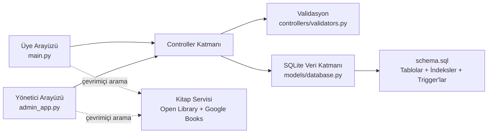

<div align="center">

# LibSys

### Python, SQLite ve CustomTkinter ile geliştirilmiş masaüstü kütüphane yönetim sistemi


</div>

## Proje hakkında

LibSys, İş Yeri Uygulaması Faz 2 kapsamında seçtiğim **Kütüphane Yönetim Sistemi** projesidir. Projede istenen teknoloji kombinasyonu olarak **Python + SQL + GitHub** kullandım.

Uygulama; kitap, üye ve ödünç işlemlerini tek bir sistemde topluyor. Üyeler ve yöneticiler için iki ayrı masaüstü arayüzü bulunuyor. Üye tarafında kitap arama, kitap ayrıntılarını görüntüleme, ödünç alma, iade etme, bildirimleri takip etme ve kitap talebi oluşturma gibi işlemler yapılabiliyor. Yönetici tarafında ise kitap ve üye yönetimi, üyelik onayı, ödünç geçmişi, manuel iade, çevrimiçi servislerden kitap ekleme ve veri tabanı bakım işlemleri yer alıyor.

**GitHub deposu:**  
https://github.com/zaorenn/libsys-library-management-system

**Commit geçmişi:**  
https://github.com/zaorenn/libsys-library-management-system/commits/main/

---

## Projenin temel özellikleri

### Üye uygulaması

- Üye kaydı ve giriş işlemleri
- Kullanıcı adı veya e-posta ile giriş
- Kitap kataloğunu görüntüleme
- Kitap adına, yazara veya ISBN'e göre arama
- Kitap ayrıntılarını ve kapak görselini görüntüleme
- Kitap ödünç alma ve iade etme
- Bildirimleri görüntüleme
- Kitap talebi oluşturma
- Profil değişikliği talebi gönderme
- Açık ve koyu tema seçimi

### Yönetici uygulaması

- Genel sistem özetini görüntüleme
- Kitap ekleme, düzenleme ve arşivleme
- Üye ekleme, güncelleme, onaylama ve arşivleme
- Aktif ve tamamlanmış ödünç işlemlerini görüntüleme
- Manuel iade işlemi
- Kitap ve profil taleplerini onaylama veya reddetme
- Open Library ve Google Books üzerinden kitap arama
- Veri tabanı bütünlük kontrolü
- Katalog metadatasını onarma

---

## Geliştirme sürecim

Projeyi **4 Haziran 2026 ile 21 Haziran 2026** tarihleri arasında geliştirdim. Çalıştığım günlerde ortalama üç-dört saatimi projeye ayırdım. Bazı günler DataCamp eğitimlerine iki-üç saat çalışıp hemen ardından öğrendiğim konuları projede denemeye çalıştım.

İlk başta bu yöntemin her zaman iyi sonuç vermediğini fark ettim. Bir konuyu yeni öğrenir öğrenmez doğrudan büyük bir projeye eklemeye çalışınca bazen neyin yanlış olduğunu ayırt etmek zorlaşıyordu. Daha sonra küçük örnekler hazırlayıp önce tek başına çalıştırmaya, ardından projeye eklemeye başladım.

### İlk çalışmalar ve yerel kopyalar

Projeyi VS Code üzerinde geliştirirken başlarda düzenli bir sürüm kontrolü kullanmıyordum. Farklı denemeleri kaybetmemek için proje klasörünün birden fazla kopyasını oluşturdum. Bu yöntem kısa süre için işe yarasa da daha sonra hangi klasörde hangi değişikliğin bulunduğunu takip etmeyi zorlaştırdı.

GitHub Foundations eğitimini projenin son günlerine kadar tamamlamadığım için Git ve GitHub kullanımına kodun ileri bir aşamasında başladım. Bu nedenle GitHub üzerindeki commit tarihleri, projenin tamamının 4-21 Haziran arasındaki gerçek geliştirme süresini eşit biçimde göstermiyor. Commitlerin çoğunun son günlerde toplanmasının temel nedeni budur.

### GitHub'a geçiş ve deneme deposu

Commit işlemlerinden emin olmak için önce ayrı bir GitHub deposu açarak clone, commit, push ve pull denemeleri yaptım. Bu denemeler sırasında bilgisayarımda çalışan bazı bölümlerin yeni indirilen depoda çalışmadığını gördüm. Bunun sonucunda yerel bilgisayarda fark edilmeyen bazı sorunları tespit ettim:

- Eksik bağımlılıkların requirements dosyasına eklenmemesi
- Yerel dosya yollarına bağlı kodlar
- Git'e eklenmemesi gereken veritabanı ve geçici dosyalar
- Yeni kurulumda otomatik oluşması gereken klasör veya verilerin eksik olması
- Yalnız kendi bilgisayarımda bulunan ayarlara güvenilmesi

Bu kontrollerden sonra projeyi temiz bir klasörde tekrar indirip çalıştırmayı teslim öncesi kontrol adımlarından biri hâline getirdim.

### Son depo ve commit geçmişi

Farklı denemelerden sonra projeyi **LibSys** adı altında son bir depoda topladım. Önceki kopyalarda çalışan bölümleri yeni depoya aktarırken kodu tekrar gözden geçirip düzeltmeye çalıştım. Commit geçmişi kusursuz ve eşit aralıklı değildir; çünkü GitHub kullanımına projenin son kısmında başladım. Buna rağmen son depoda yaptığım düzeltmeleri mümkün olduğunca anlamlı commit mesajlarıyla aktarmaya çalıştım.

Bu süreç bana Git'in yalnız teslim aşamasında kullanılan bir araç olmadığını gösterdi. Yeni bir projeye başlarken ilk günden itibaren Git kullanmanın, klasör kopyaları oluşturmaktan çok daha güvenli ve anlaşılır olduğunu öğrendim.

---

## Yapay zekâ araçlarını nasıl kullandım?

Proje sürecinde NotebookLM ve GPT tabanlı araçlardan yararlandım. Bu araçları özellikle hata kayıtlarını açıklamak, uzun dokümanlardan kısa notlar çıkarmak, anlamadığım konuları daha basit şekilde tekrar öğrenmek ve yazdığım kodun projedeki diğer bölümlerle nasıl birleştirilebileceğini görmek için kullandım.

Başlangıçta bazı yapay zekâ ajanlarına geniş kapsamlı görevler verdim. Örneğin bütün bir dosyayı veya birkaç modülü aynı anda düzeltmesini istediğim oldu. Ancak ajan, kendisine mantıklı gelen farklı bir yapı kurmaya çalışırken çalışan kodun önemli bölümlerini de değiştirebiliyordu. Bazen daha önce çalışan özellikler kullanılamaz hâle geldi. Bu durum iki kez projeyi büyük ölçüde yeniden düzenlememe sebep oldu.

Daha sonra çalışma biçimimi değiştirdim. Yapay zekâya doğrudan bütün projeyi yazdırmak yerine:

- Yalnız ihtiyaç duyduğum küçük kod bloklarını hazırlatmaya,
- Aldığım hata mesajlarını açıklatmaya,
- Yazdığım kodun mevcut yapıya nasıl eklenebileceğini sormaya,
- Bir değişikliğin başka hangi dosyaları etkileyebileceğini kontrol ettirmeye,
- Test senaryoları için fikir almaya başladım.

Önceki depolardaki açıklamaları ve bazı düzenlemeleri son depoya taşırken süreci hızlandırmak amacıyla birden fazla yapay zekâ aracını aynı anda kullandım. Sonrasında eklenen açıklamaları ve değişiklikleri rastgele değil, dosya dosya örnekler seçerek kontrol ettim. Kodun çalışması, testlerin geçmesi ve açıklamaların gerçekten ilgili kodu anlatması benim için son kontrol oldu.

Bu projenin bana öğrettiği en önemli şeylerden biri şudur: **Yapay zekâ bir projeyi benim yerime güvenilir biçimde tamamlayan bir araç değildir; doğru kullanıldığında geliştirme ve öğrenme sürecini hızlandıran bir yardımcıdır.** Üretilen kodun neden çalıştığını anlamadan kabul etmek, projeyi düzeltmek yerine daha karmaşık hâle getirebilir.

---

## Karşılaştığım teknik zorluklar

### Öğrendiğim bilgileri gerçek projeye aktarmak

Eğitimlerde tek başına anlaşılır görünen konular, arayüz, veri tabanı ve iş kuralları bir araya geldiğinde daha zor hâle geldi. Bu nedenle projeyi `views`, `controllers`, `models` ve `services` bölümlerine ayırdım.

### Ödünç alma, iade ve stok hesabı

Bir kitap ödünç alındığında stok sayısının yalnız bir kez azalması, iade edildiğinde yalnız bir kez artması gerekiyordu. Aynı anda iki işlemin son kitabı ödünç almaya çalışması da ayrı bir sorundu. Bu işlemleri Python kontrollerine ek olarak SQLite transaction ve trigger yapılarıyla güvence altına aldım.

### SQLite trigger'ları

Trigger'ların çalışma sırasını ve hangi durumda devreye girdiğini anlamak başlangıçta zor oldu. Özellikle iade işleminin tekrar çalıştırılması hâlinde stoğun ikinci kez artmaması gerekiyordu. Bunun için trigger koşullarını eski ve yeni değerleri karşılaştıracak şekilde düzenledim.

### Çevrimiçi kitap servisleri

Open Library ve Google Books aynı biçimde veri döndürmüyor. Bazı kitaplarda ISBN, açıklama veya kapak bilgisi eksik olabiliyor. Sonuçları ortak bir yapıya dönüştürdüm ve ilk servis yeterli sonuç vermezse diğer servise geçen bir yedekleme akışı kullandım.

### ISBN doğrulaması

Sadece ISBN uzunluğunu kontrol etmek yeterli olmadı. Hatalı ISBN değerleri veri tabanına eklenebildiği için ISBN-10 ve ISBN-13 checksum kontrollerini ekledim.

### Arayüz düzeni

Farklı pencere boyutlarında kitap kartlarının taşması, fare tekerleğinin bazı alanlarda çalışmaması ve kapak görsellerinin arayüzü yavaşlatması sorun oluşturdu. Dinamik sütun sayısı, özel kaydırma yönlendirmesi ve sınırlı görsel önbelleği kullandım.

### Yerel ortam ile indirilen depo arasındaki farklar

Projenin kendi bilgisayarımda çalışması yeterli değildi. Temiz bir klasöre clone edilen sürümde de çalışması gerekiyordu. Deneme deposu sayesinde bağımlılık, dosya yolu, başlangıç verisi ve `.gitignore` ile ilgili eksikleri fark ettim.

---

## Proje sonunda öğrendiklerim

Bu proje sonunda:

- Python ile modüler masaüstü uygulama geliştirmeyi,
- Arayüz, iş mantığı ve veri tabanı kodunu birbirinden ayırmayı,
- SQL tablo ilişkileri ve foreign key kullanımını,
- `CHECK`, indeks ve trigger yapılarının veri bütünlüğüne etkisini,
- Transaction kullanımının neden önemli olduğunu,
- JOIN ve GROUP BY sorgularıyla rapor oluşturmayı,
- pytest ile geçici veritabanı kullanan testler yazmayı,
- Git ve GitHub ile değişiklikleri takip etmeyi,
- Bir projenin temiz kurulumda ayrıca denenmesi gerektiğini,
- Yapay zekâ çıktılarının mutlaka okunması ve test edilmesi gerektiğini öğrendim.

Daha önce GitHub'ı çoğunlukla dosya yüklenen bir yer gibi görüyordum. Proje sonunda commit geçmişinin, bir yazılımın nasıl geliştiğini gösteren önemli bir kayıt olduğunu daha iyi anladım.

---

## Python, SQL ve GitHub'ın projedeki rolü

| Teknoloji | Projedeki kullanımı |
|---|---|
| **Python** | Kullanıcı ve yönetici arayüzlerini, kimlik doğrulamayı, CRUD işlemlerini, validasyonları, çevrimiçi kitap servislerini ve testleri çalıştırır. |
| **SQL / SQLite** | Kitap, üye, ödünç ve talep verilerini saklar. İlişkiler, kısıtlar, indeksler, trigger'lar ve raporlama sorguları bu bölümde yer alır. |
| **Git** | Dosyalardaki değişiklikleri takip etmek ve belirli aşamalara geri dönebilmek için kullanılmıştır. |
| **GitHub** | Kaynak kodun uzaktan yedeklenmesini, teslim edilmesini ve GitHub Actions ile otomatik testlerin çalıştırılmasını sağlar. |

---

## Kullanılan teknolojiler ve bağımlılıklar

- Python 3.10 veya üzeri
- SQLite 3
- CustomTkinter
- bcrypt
- Pillow
- Requests
- pytest
- Ruff
- GitHub Actions

Çalışma zamanı bağımlılıkları `requirements.txt`, geliştirme ve test bağımlılıkları ise `requirements-dev.txt` dosyasında yer alır.

---

## Proje mimarisi



Arayüz dosyaları kullanıcı etkileşimini yönetir. İş kuralları controller katmanında, veri tabanı bağlantıları model katmanında, dış servis işlemleri ise service katmanında tutulur.

---

## Veri tabanı tasarımı

Ana tablolar:

- `admins`
- `members`
- `books`
- `borrows`
- `book_requests`
- `profile_requests`
- `notifications`
- `audit_logs`

Temel kurallar:

- ISBN ve e-posta alanları benzersizdir.
- Foreign key kontrolleri her bağlantıda etkinleştirilir.
- Kullanılabilir kopya sayısı sıfırın altına veya toplam kopya sayısının üstüne çıkamaz.
- Stokta olmayan kitap için ödünç kaydı oluşturulamaz.
- İade sırasında stok yalnız ilk iadede artırılır.
- Gecikme cezası günlük 5 TL olarak hesaplanır.
- Kitap ve üyeler geçmiş kayıtlarını korumak için doğrudan silinmek yerine arşivlenir.

Tam şema için [`schema.sql`](schema.sql), JOIN ve GROUP BY rapor örnekleri için [`reports.sql`](reports.sql) dosyasına bakılabilir.

---

## Özellik matrisi

| Modül | Oluştur | Görüntüle | Güncelle | Sil / Arşivle |
|---|:---:|:---:|:---:|:---:|
| Kitap | ✓ | ✓ | ✓ | ✓ |
| Üye | ✓ | ✓ | ✓ | ✓ |
| Ödünç | ✓ | ✓ | İade ile güncellenir | Geçmiş korunur |
| Kitap talebi | ✓ | ✓ | Onay / ret | ✓ |
| Bildirim | ✓ | ✓ | Okundu bilgisi | Üye silinince cascade |

---

## Başlangıç kataloğu

Uygulama ilk kez çalıştırıldığında başlangıç kataloğu otomatik olarak hazırlanır.

- Katalogda 80 kitap bulunur.
- Kitaplarda ISBN, kategori, yayın yılı, açıklama ve kapak adresi yer alır.
- Başlangıç verisi idempotent şekilde yüklenir; uygulamayı tekrar açmak aynı kitapları yeniden eklemez.
- İnternet bağlantısı yoksa temel kitap bilgileri görüntülenmeye devam eder ve kapak yerine yerel yer tutucu kullanılır.

---

## Kurulum

### 1. Depoyu indirin

```bash
git clone https://github.com/zaorenn/libsys-library-management-system.git
cd libsys-library-management-system
```

### 2. Sanal ortam oluşturun

```bash
python -m venv .venv
```

Windows PowerShell:

```powershell
.\.venv\Scripts\Activate.ps1
python -m pip install -r requirements.txt
```

macOS / Linux:

```bash
source .venv/bin/activate
python -m pip install -r requirements.txt
```

### 3. Uygulamaları çalıştırın

Üye uygulaması:

```bash
python main.py
```

Yönetici uygulaması:

```bash
python admin_app.py
```

Katalog ve demo hesapları ilk açılış sırasında otomatik hazırlanır. İstenirse demo verisi ayrıca şu komutla oluşturulabilir:

```bash
python seed_db.py
```

Tamamen temiz bir demo veritabanı oluşturmak için:

```bash
python seed_db.py --reset
```

> `--reset` mevcut yerel veritabanı içeriğini siler.

---

## Demo hesapları

| Rol | Kullanıcı adı | Parola |
|---|---|---|
| Yönetici | `admin` | `admin123` |
| Deneme üyesi | `uye` | `uye123` |

Bu hesaplar yalnızca yerel değerlendirme ve test içindir. Gerçek kullanımda varsayılan parolalar değiştirilmelidir.

İlk veritabanı oluşturulmadan önce yönetici bilgileri ortam değişkenleriyle değiştirilebilir:

```powershell
$env:LIBSYS_ADMIN_USERNAME = "yonetici"
$env:LIBSYS_ADMIN_PASSWORD = "GucluBirParola123!"
python admin_app.py
```

Demo üye hesabının otomatik oluşması istenmiyorsa uygulama çalıştırılmadan önce `LIBSYS_ENABLE_DEMO_ACCOUNT=0` değişkeni kullanılabilir.

---

## Test ve kalite kontrolleri

Geliştirme bağımlılıklarını kurmak için:

```bash
python -m pip install -r requirements-dev.txt
```

Temel kontroller:

```bash
python -m compileall -q .
ruff check .
python -m pytest -q
```

Ek kontroller:

```bash
python -m tools.verify_catalog --online
python -m tools.smoke_gui
```

Mevcut test paketi 29 test içerir. Testlerde geçici veritabanları kullanıldığı için yerel `libsys.db` dosyası değiştirilmez. Ayrıntılı test kapsamı [`docs/TEST_PLAN.md`](docs/TEST_PLAN.md) dosyasında bulunur.

GitHub Actions her push ve pull request işleminde sözdizimi, Ruff ve pytest kontrollerini otomatik olarak çalıştırır.

---

## Proje yapısı

```text
LibSys/
├── main.py                     # Üye uygulaması
├── admin_app.py                # Yönetici uygulaması
├── seed_db.py                  # Demo verisi yükleme
├── schema.sql                  # Tablolar, indeksler ve trigger'lar
├── reports.sql                 # JOIN / GROUP BY rapor sorguları
├── requirements.txt            # Çalışma zamanı bağımlılıkları
├── requirements-dev.txt        # Test ve kalite bağımlılıkları
├── controllers/
│   ├── auth.py                 # Giriş, kayıt ve parola işlemleri
│   ├── library.py              # Kitap, üye, ödünç ve talep işlemleri
│   └── validators.py           # Veri doğrulama fonksiyonları
├── models/
│   ├── catalog.py              # Başlangıç kitap kataloğu
│   └── database.py             # Veri tabanı bağlantısı ve şema işlemleri
├── services/
│   └── book_api.py             # Open Library ve Google Books servisi
├── views/
│   ├── theme.py                # Tema ve ortak görünüm ayarları
│   ├── ui.py                   # Üye arayüzü
│   └── admin_ui.py             # Yönetici arayüzü
├── tests/
│   ├── test_core.py
│   ├── test_catalog.py
│   ├── test_book_api.py
│   └── test_sql_artifacts.py
├── tools/
│   ├── verify_catalog.py
│   └── smoke_gui.py
├── docs/
│   └── TEST_PLAN.md
└── .github/workflows/tests.yml
```

`libsys.db` ilk çalıştırmada otomatik oluşur. Kişisel veya yerel veri içerebileceği için Git deposuna eklenmez.

---

## Güvenlik ve veri bütünlüğü

- Parolalar açık metin olarak saklanmaz; bcrypt ile hashlenir.
- SQL sorgularında parametreli sorgular kullanılır.
- ISBN-10 ve ISBN-13 checksum kontrolü yapılır.
- E-posta, telefon, parola, yıl, URL ve kopya sayısı doğrulanır.
- İndirilen görseller için boyut sınırı ve zaman aşımı uygulanır.
- Hassas yerel dosyalar `.gitignore` kapsamındadır.
- Ödünç ve iade işlemleri audit log tablosuna kaydedilir.
- Aktif ödüncü bulunan kitap veya üyenin arşivlenmesi engellenir.

---

## Bilinen sınırlamalar

- Uygulama masaüstü ve yerel SQLite veri tabanı üzerinde çalışır.
- Çok sayıda kullanıcının aynı anda bağlandığı bir sunucu sistemi değildir.
- Kitap kapağı ve çevrimiçi arama özellikleri internet bağlantısına bağlıdır.
- E-posta veya SMS bildirimi bulunmamaktadır.
- Gecikme cezaları sistemde hesaplanır ancak çevrimiçi ödeme özelliği yoktur.

---

## Gelecekte eklemek istediğim özellikler

- Django veya benzeri bir yapı ile web sürümü
- PostgreSQL veya MySQL desteği
- Barkod veya QR kod ile ödünç ve iade
- E-posta ve SMS bildirimleri
- Rezervasyon ve bekleme listesi
- Kullanıcı rollerinin daha ayrıntılı yönetimi
- Grafiklerle gelişmiş istatistik ve raporlama
- Otomatik yedekleme ve geri yükleme
- Docker ile daha kolay kurulum

---

## Teslim kontrol listesi

- [x] Python + SQL + GitHub teknoloji kombinasyonu
- [x] Kitap, üye ve ödünç CRUD işlemleri
- [x] SQLite veri tabanı bağlantısı
- [x] Tablo ilişkileri, indeksler ve trigger'lar
- [x] JOIN ve GROUP BY rapor sorguları
- [x] Üye ve yönetici arayüzleri
- [x] Otomatik testler
- [x] GitHub Actions kalite kontrolü
- [x] Kurulum ve çalıştırma talimatları
- [x] Geliştirme süreci, yaşanan zorluklar ve öğrenilenler
- [x] GitHub depo bağlantısı

---

## Son not

LibSys benim için yalnızca çalışan bir kütüphane uygulaması hazırlama çalışması olmadı. Proje boyunca kod yazmanın yanında sürüm kontrolü, temiz kurulum, test, veri tabanı bütünlüğü, dokümantasyon ve kullanılan araçların sınırlarını öğrenme fırsatı buldum.

En önemli kazanımım, bir özelliğin yalnız kendi bilgisayarımda çalışmasının yeterli olmadığını ve üretilen her kodun kaynağı ne olursa olsun anlaşılması, kontrol edilmesi ve test edilmesi gerektiğini görmek oldu.
