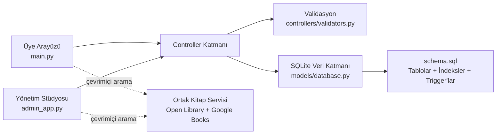

<div align="center">

# ◈ LibSys

### Kütüphane yönetim sistemi.

Python, SQLite ve CustomTkinter ile geliştirilen; üye deneyimi ile yönetim operasyonlarını ayrı arayüzlerde birleştiren modern kütüphane yönetim sistemi.


</div>

## Proje özeti

LibSys, Faz 2 **Proje 1 – Kütüphane Yönetim Sistemi** için **Python + SQL + GitHub** teknoloji kombinasyonuyla hazırlanmıştır. Uygulama kitap, üye ve ödünç işlemlerinin CRUD akışlarını; güvenli kimlik doğrulamayı, stok/ceza otomasyonunu ve açıklayıcı testleri tek projede sunar.

İki farklı masaüstü deneyimi vardır:

- **Üye uygulaması:** 80 kapaklı ve özetli başlangıç kataloğu, anlık arama, kitap detayları, ödünç/iade, bildirimler, çevrimiçi kitap isteği, profil talebi ve tema seçimi.
- **Yönetim stüdyosu:** canlı gösterge paneli, kitap/üye CRUD, üyelik onayı, tüm ödünç geçmişi, manuel iade, Open Library + Google Books entegrasyonu, talep yönetimi ve veri bakım araçları.

## Neden farklı?

- **Neutral Glass tasarım sistemi:** koyu modda siyaha yakın cam yüzeyler, açık modda buzlu beyaz katmanlar, yumuşak gri sınırlar ve ölçülü turkuaz durum vurguları.
- **Hazır ve gerçek katalog:** ilk açılışta otomatik eklenen 80 seçili eser; benzersiz ISBN, gerçek Open Library kapağı ve Türkçe özet içerir.
- **Çift kaynaklı çevrimiçi arama:** ana kaynak Open Library, otomatik yedek Google Books'tur; yalnız kapaklı ve geçerli ISBN'li sonuçlar tek modelde birleştirilip önbelleğe alınır.
- **Geçmişi koruyan arşivleme:** kitap ve üyeler doğrudan yok edilmez; aktif ödünç kontrolünden sonra arşivlenir.
- **Veritabanı seviyesinde güvence:** stok düşürme, iade, gecikme cezası ve denetim günlüğü SQLite trigger'larıyla korunur.
- **Eşzamanlı işlem güvenliği:** ödünç işlemleri `BEGIN IMMEDIATE`, busy timeout ve atomik transaction kullanır.
- **Savunmacı doğrulama:** ISBN-10/13 checksum, e-posta, telefon, parola, yıl, URL ve kopya sayısı doğrulanır.
- **Dış servis zarif düşüşü:** Google Books, Open Library veya kapak servisi erişilemezse temel kütüphane işlevleri çalışmaya devam eder.

## Hazır katalog

Katalog ilk `main.py` veya `admin_app.py` çalıştırmasında otomatik hazırlanır; ayrıca komut çalıştırmak gerekmez. Başlangıç verisi:

- Tam olarak 80 seçili eser içerir.
- Her kitapta geçerli ISBN-10/13 checksum, kategori, yayın yılı ve en az 100 karakterlik Türkçe özet bulunur.
- Her kapak benzersiz Open Library ISBN adresine bağlıdır; 80 adresin tamamı görsel içerik veya geçerli görsel yönlendirmesiyle doğrulanmıştır.
- Yükleme idempotenttir: uygulamayı tekrar açmak kopya kitap üretmez.
- Üye kataloğu sayfalı/yükle-devam akışıyla yöneticinin gördüğü aktif envanterin tamamını gösterir.
- Mevcut kayıtlardaki kapak ve özetler yönetici **Ayarlar → Katalog Metadatasını Onar** işlemiyle geri yüklenebilir.

Kapaklar internetten yüklenir. Ağ yoksa uygulama kitap bilgilerini ve yerel yer tutucuyu göstermeye devam eder.

## Özellik matrisi

| Modül | Oluştur | Oku | Güncelle | Sil / Arşivle |
|---|:---:|:---:|:---:|:---:|
| Kitap | ✓ | ✓ | ✓ | ✓ |
| Üye | ✓ | ✓ | ✓ (onay/profil talebi) | ✓ |
| Ödünç | ✓ | ✓ | ✓ (iade) | Denetim geçmişi korunur |
| Kitap isteği | ✓ | ✓ | ✓ (onay/ret) | ✓ |
| Bildirim | ✓ | ✓ | ✓ (okundu) | Üye silinince cascade |

## Mimari



Arayüz yalnız kullanıcı etkileşimini yönetir; iş kuralları controller katmanında, veri bütünlüğü ise hem controller transaction'larında hem SQL şemasında uygulanır.

## Teknolojiler

- Python 3.10+
- SQLite 3
- CustomTkinter
- bcrypt
- Pillow
- Requests
- pytest ve Ruff
- GitHub Actions

## Hızlı başlangıç

### 1. Ortamı hazırlayın

```bash
git clone https://github.com/zaorenn/libsys-library-management-system.git
cd libsys-library-management-system
python -m venv .venv
```

Windows PowerShell:

```powershell
.\.venv\Scripts\Activate.ps1
python -m pip install -r requirements.txt
```

macOS / Linux:

```bash
source .venv/bin/activate
python -m pip install -r requirements.txt
```

### 2. Demo verisini hazırlayın (isteğe bağlı)

```bash
python seed_db.py
```

Katalog, yönetici ve onaylı deneme üyesi ilk açılışta otomatik oluşur; doğrudan uygulamaları başlatabilirsiniz. Bu komut demo parolalarını README değerlerine geri döndürür ve mevcut verileri silmez. Tamamen temiz demo veritabanı istenirse açıkça şu komut kullanılır:

```bash
python seed_db.py --reset
```

> `--reset` mevcut yerel veritabanı içeriğini siler.

### 3. Uygulamaları açın

Üye uygulaması:

```bash
python main.py
```

Yönetim stüdyosu:

```bash
python admin_app.py
```

## Demo hesapları

İlk açılıştan itibaren (ek bir seed komutu gerektirmeden):

| Rol | Kullanıcı | Parola |
|---|---|---|
| Yönetici | `admin` | `admin123` |
| Deneme üyesi | `uye` | `uye123` |

Üye giriş alanı hem e-posta hem kullanıcı adı kabul eder. Deneme üyesinin e-posta ve telefon alanları özellikle boştur; kayıt formunun güçlü parola ve geçerli e-posta kuralları gevşetilmeden yalnız veritabanı başlangıç katmanı tarafından oluşturulur. Yönetici **Üyeler** ekranında **Deneme Üyesi** ve `uye` kullanıcı adıyla görünür. Böylece değerlendiren kişi yukarıdaki kısa bilgilerle doğrudan giriş yapabilir.

İlk veritabanı oluşturulmadan önce yönetici bilgileri ortam değişkenleriyle değiştirilebilir:

```powershell
$env:LIBSYS_ADMIN_USERNAME = "yonetici"
$env:LIBSYS_ADMIN_PASSWORD = "GucluBirParola123!"
python admin_app.py
```

> Demo parolaları yalnız yerel değerlendirme içindir. Gerçek kullanımda hemen değiştirilmelidir. Mevcut veritabanları yükseltilirken hesaplar ve parolalar korunur.

Bilinen demo hesabının oluşturulması istenmeyen bir kurulumda uygulama açılmadan önce `LIBSYS_ENABLE_DEMO_ACCOUNT=0` ortam değişkeni ayarlanabilir.

## Test ve kalite

Geliştirme bağımlılıklarını kurun:

```bash
python -m pip install -r requirements-dev.txt
```

Tüm kontroller:

```bash
python -m compileall -q .
ruff check .
python -m pytest -q
python -m tools.verify_catalog --online
python -m tools.smoke_gui
```

Test paketi geçici veritabanları kullanır; `libsys.db` dosyanıza dokunmaz. `verify_catalog` 80 uzak kapağı, `smoke_gui` ise ekran ortamında 5 üye ve 10 yönetici görünümünü açarak doğrular. Ayrıntılı kapsam [test planında](docs/TEST_PLAN.md) yer alır. Otomatik kontroller her push ve pull request'te GitHub Actions tarafından çalıştırılır.

## Yönetim stüdyosundaki çalışan araçlar

| Ekran | İşlev |
|---|---|
| Genel Bakış | Canlı eser/kopya/üye/ödünç/bekleyen işlem metrikleri ve son hareketler |
| Onay Bekleyenler | Seçili üyeyi açık buton veya çift tıklamayla onaylama |
| Kitaplar | Arama, ekleme, düzenleme, kapak/özet güncelleme ve geçmişi koruyan arşivleme |
| İnternetten Ekle | Open Library araması, Google Books yedeği, geçerli ISBN, açıklama ve otomatik kapakla ekleme |
| İstenen Kitaplar | Üyenin aynı çevrimiçi kaynaktan seçtiği kitabı tüm metadatasıyla ekleme veya bildirimli reddetme |
| Üyeler | Arama, manuel aktif üye oluşturma ve güvenli arşivleme |
| Profil İstekleri | E-posta çakışma kontrollü onay/ret ve üyeye bildirim |
| Tüm Geçmiş | Aktif ve tamamlanmış ödünçleri izleme, manuel iade |
| Profilim | Yönetici bilgisi ve güçlü parola güncelleme |
| Ayarlar | Açık/koyu tema, SQLite bütünlük denetimi ve katalog metadata onarımı |

Yönetici kenar çubuğunda ayrıca güvenli **Oturumu Kapat** işlemi bulunur.

## SQL tasarımı

Ana tablolar:

- `admins`, `members`, `books`, `borrows`
- `book_requests`, `profile_requests`, `notifications`
- `audit_logs`

Önemli kurallar:

- Her SQLite bağlantısında foreign key denetimi açılır.
- ISBN ve e-posta alanları benzersizdir.
- `available_copies`, `0 <= mevcut <= toplam` koşulunu sağlar.
- Stok dışı doğrudan SQL ödünç eklemesi `before_borrow_insert` trigger'ı tarafından reddedilir.
- İade trigger'ı stoğu yalnız ilk iadede artırır ve günlük 5 TL gecikme cezası hesaplar.
- Arama, aktif ödünç ve bildirim sorguları indekslenmiştir.

Tam şema [schema.sql](schema.sql), JOIN/GROUP BY rapor örnekleri [reports.sql](reports.sql) dosyasındadır.

## Proje yapısı

```text
LibSys/
├── main.py                     # Üye uygulaması
├── admin_app.py                # Yönetim stüdyosu
├── seed_db.py                  # İdempotent demo veri yükleyici
├── schema.sql                  # Tablolar, indeksler ve trigger'lar
├── reports.sql                 # JOIN / GROUP BY rapor sorguları
├── requirements.txt            # Çalışma zamanı bağımlılıkları
├── requirements-dev.txt        # Test ve kalite araçları
├── controllers/
│   ├── auth.py                 # Kimlik ve parola işlemleri
│   ├── library.py              # Kitap, üye, ödünç ve talep iş kuralları
│   └── validators.py           # Merkezi veri doğrulama
├── models/
│   ├── catalog.py              # 80 kapaklı ve özetli başlangıç kataloğu
│   └── database.py             # Bağlantı, WAL transaction ve şema geçişleri
├── services/
│   └── book_api.py             # Open Library + Google Books ortak arama servisi
├── views/
│   ├── theme.py                # LibSys Neutral Glass tasarım sistemi
│   ├── ui.py                   # Üye arayüzü
│   └── admin_ui.py             # Yönetici arayüzü
├── tests/
│   ├── test_core.py            # İş kuralı entegrasyon testleri
│   ├── test_catalog.py         # Katalog bütünlüğü ve idempotent yükleme
│   ├── test_book_api.py        # Çevrimiçi servis normalizasyon/yedekleme testleri
│   └── test_sql_artifacts.py   # SQL teslim dosyası testleri
├── tools/
│   ├── verify_catalog.py       # ISBN/özet/uzak kapak doğrulaması
│   └── smoke_gui.py            # 15 ekranlık gerçek GUI duman testi
├── docs/
│   └── TEST_PLAN.md            # Test kapsamı ve kabul ölçütleri
└── .github/workflows/tests.yml # CI kalite kapısı
```

`libsys.db` ilk çalıştırmada otomatik oluşur ve kişisel veri içerebileceği için Git'e eklenmez.

## Güvenlik notları

- Parolalar düz metin tutulmaz; bcrypt ile salt'lı hash saklanır.
- SQL sorguları parametreli çalışır.
- Görsel indirmeleri 5 MB ile sınırlıdır ve ağ çağrıları timeout kullanır.
- Üye kataloğu başka üyelerin kimlik bilgilerini göstermez.
- Katalog, imleç kartların üzerindeyken de fare tekerleğiyle kaydırılır ve sona yaklaşıldığında sonraki eserleri yükler.
- Üye bildirimi sahiplik denetimiyle okundu işaretlenir.
- Hassas yerel dosyalar ve veritabanları `.gitignore` kapsamındadır.

## Teslim kontrol listesi

- [x] Python + SQL teknoloji kombinasyonu
- [x] Kitap, üye ve ödünç CRUD akışları
- [x] SQLite bağlantısı, şema ve SQL raporları
- [x] Üye ve yönetici GUI'leri
- [x] Otomatik testler ve manuel test planı
- [x] GitHub Actions kalite kontrolü
- [x] Açıklayıcı README ve proje yapısı

---

LibSys, eğitim projesi sınırlarının ötesinde; izlenebilir, test edilebilir ve güvenli bir masaüstü kütüphane uygulaması örneği olarak tasarlanmıştır.
